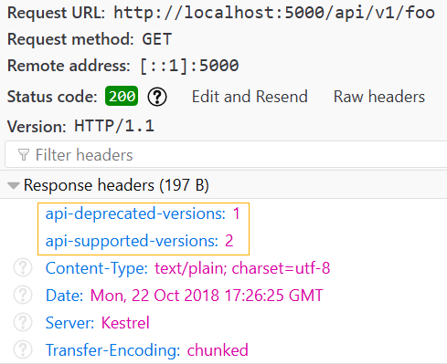

You probably read about the [requirements](https://github.com/Microsoft/api-guidelines/blob/master/Guidelines.md?WT.mc_id=-blog-scottha#12-versioning) for using API versioning. As we know, implementing versioning in ASP.NET Web API was a difficult and time-consuming task. However, in ASP.NET Core, all those steps can be done in a single line, which we will discuss below.

----------

To start, execute the following command in the Package Manager Console to install the [Microsoft.AspNetCore.Mvc.Versioning](https://www.nuget.org/packages/Microsoft.AspNetCore.Mvc.Versioning) package:

```csharp
Install-Package Microsoft.AspNetCore.Mvc.Versioning
```

After installing, add the following snippet to the `ConfigureServices` method in your project's `Startup.cs` file:

```csharp
public void ConfigureServices(IServiceCollection services)
{
    services.AddMvc();
    services.AddApiVersioning();
    // ...
}
```

Initially, after installing the package, you might have some old APIs with no version specified. You can add a default version to the application and use it for endpoints that do not have a version:

```csharp
services.AddApiVersioning(opt =>
{
    opt.AssumeDefaultVersionWhenUnspecified = true;
    opt.DefaultApiVersion = new ApiVersion(1, 0);
});
```

Then, your API will be accessible from this endpoint:
-   api/foo?api-version=1.0/

The `DefaultApiVersion` parameter is set to a new `ApiVersion`. The `ApiVersion` constructor has various overloads. The overload we are using takes the major version as the first parameter and the minor version as the second. Alternatively, you can use DateTime as the version:

```csharp
opt.DefaultApiVersion = new ApiVersion(new DateTime(2018, 10, 22));
```

And in this case, your API would be accessible from this endpoint:

-   api/foo?api-version=2018-10-22

----------

### URL Path Segment versioning

So far, our API Versioning relies on **Query String Parameters**. But what if we want to access our APIs like this instead: `api/v1/foo`?

To achieve that, you just need to change the route of your controller like this:

```csharp
[Route("api/v{version:apiVersion}/[controller]")]
public class FooController : ControllerBase
{
    public ActionResult<IEnumerable<string>> Get()
    {
        return new[] { "value1", "value2" };
    }
}
```

----------

### Header versioning

The third method for implementing versioning is using Headers. To enable Header versioning, modify your registration like this:

```csharp
public void ConfigureServices(IServiceCollection services)
{
    services.AddApiVersioning(opt => opt.ApiVersionReader = 
        new HeaderApiVersionReader("api-version")
    );
}
```

With this change, you can no longer test your API through a browser, which is one downside to this approach. You'll need to use tools like Postman or CURL for sending a GET requests with custom headers:


----------

### Deprecating

You might want to mark a version as deprecated. Note that deprecating an API does not mean it is **obsolete**. You can mark a version as deprecated like this, using `Deprecated` property:

```csharp
[ApiVersion("2")]
[ApiVersion("1", Deprecated = true)]
[Route("api/v{version:apiVersion}/[controller]")]
public class FooController : ControllerBase
{
    [HttpGet]
    public string Get() => "I'm deprecated, Bye bye :(";

    [HttpGet, MapToApiVersion("2.0")]
    public string GetV2() => "Hello world ! :D";
}
```

To report the API names and their support status in the response headers, `ReportApiVersions` must be enabled:

```csharp
services.AddApiVersioning(opt =>
{
    opt.DefaultApiVersion = new ApiVersion(1, 0);
    opt.AssumeDefaultVersionWhenUnspecified = true;
    opt.ReportApiVersions = true;
});
```

After thing change, the response headers will look like this:



----------

### Ignore versioning

If you have a controller in your application that will not change, you can prevent versioning it using `ApiVersionNeutral` attribute:

```csharp
[ApiVersionNeutral]
[Route("api/[controller]")]
public class BarController : ControllerBase
{
    public string Get() => HttpContext.GetRequestedApiVersion().ToString();
}
```

Executing this endpoint when `AssumeDefaultVersionWhenUnspecified` is `false` will result in a **NullReferenceException**. This means, as expected, no version has been set for this endpoint.

----------

**Additional Note:**

To update or introduce a new version of a controller with a different version, there is no need to rename the old class to avoid conflicts; you can use namespaces to have a controller with the same name but different versions and functionality.

```csharp
namespace TestVersioning.Controllers.V1
{
    [ApiVersion("1", Deprecated = true)]
    [Route("api/v{version:apiVersion}/[controller]")]
    public class FooController : ControllerBase
    {
        public string Get() => "I'm deprecated, Bye bye :(";
    }
}

namespace TestVersioning.Controllers.V2
{
    [ApiVersion("2")]
    [Route("api/v{version:apiVersion}/[controller]")]
    public class FooController : ControllerBase
    {
        public string GetV2() => "Hello world ! :D";
    }
}
```